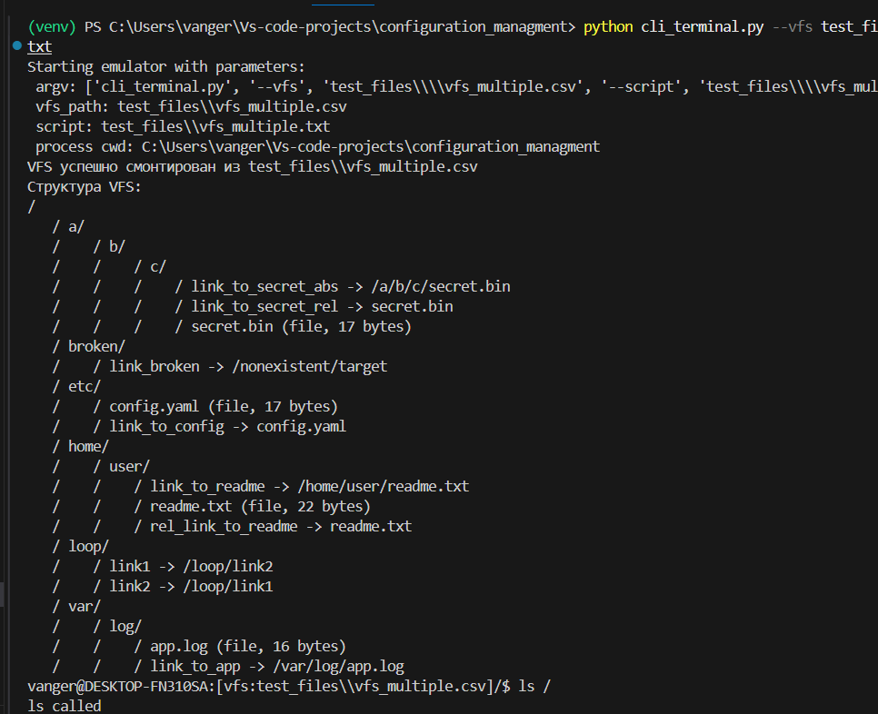

# Этап 3. VFS
## Общее описание
CLI-приложение для эмулятора языка-оболочки UNIX-системы
На этапе 1: реализован простейший прототип командного интерпретатора (CLI) в виде REPL-цикла. Команды заглушки ls и cd, работающая команда exit.
На этапе 2: добавлена поддержка конфигурации через параметры командной строки и стратовых скриптов.
На этапе 3: добавлено создания VFS из CSV файла, создается полноценная виртуальная структура в виде дерева с папками, файлами и ссылками

## Реализованные функции
1. "приглашение к вводу" пользователь видит username@hostname:cwd.
2. парсер, который раскрывает переменные вида $HOME, $VAR.
3. Вывод ошибок: "команда не существует", "неверные аргументы", "неверное количество аргументов".
4. команды-заглушки ls и cd, выводят сообщение о своем вызове и с каким аргументами были вызваны.
5. команда exit при ее вводе программа завершает свою работу.
6. Добавлены параметры --vfs указывается путь до VFS, программа отображает его в "приглашении"
7. Добавлен параметр --script - путь к файлу стратового скрипта, который эмулятор выполняет при запуске, если в скрипте есть ошибка, то она выводится, а скрипт прекращается.
8. VFS загружается из CSV: заголовки path,type,content_base64.
    - type: dir | file | link
    - file: content_base64 — base64-кодированные байты
    - link: content_base64 — base64-кодированная UTF-8 строка пути (может быть относительной)
9. Обработка ссылок:  переход по ним и проверка на зацикливание
10. Отладочный вывод структруы получившегося VFS
## Пример работы программы
пример ввода команды ls:


пример ввода команды с параметрами:


пример ввода с ошибочным число параметров:


пример ввода неизвестной команды:


пример работы команды с переменными реальных ОС:


пример ввода команды exit:


пример запуска скрипта с ошибкой:


пример запуска корректного скрипта:


пример запуска VFS с большим количеством уровней и разными типами: папки, файлы, ссылки:




## Установка и запуск
```bash
# Клонируем репозиторий
git clone https://github.com/vanger2607/MIREA_CONFIGURATION.git

# Переходим в папку проекта
cd MIREA_CONFIGURATION

# переходим в нужную ветку
git checkout stage_3_vfs
# Запускаем CLI-терминал
python cli_terminal.py
```
## Команды для тестирования
```bash
# минимальная структура vfs
python cli_terminal.py --vfs test_files\\vfs_minimal.csv
# минимальная структура vfs со скриптом
python cli_terminal.py --vfs test_files\\vfs_minimal.csv --script test_files\\vfs_minimal.txt
# структура vfs с файла, папками, ссылками
python cli_terminal.py --vfs test_files\\vfs_multiple.csv --script test_files\\vfs_multiple.txt
# многоуровневаня структура vfs
python cli_terminal.py --vfs test_files\\vfs_deep.csv --script test_files\\vfs_deep.txt


# Запуск bat скрипта:
.\\test_files\\test_run.bat 
.\\test_files\\run_deep.bat


