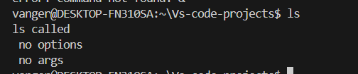
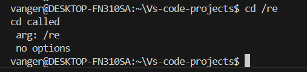
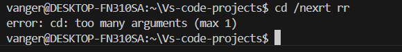
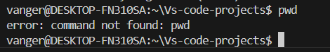
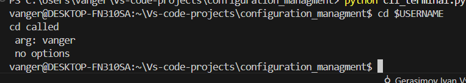
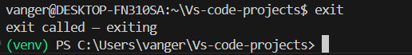
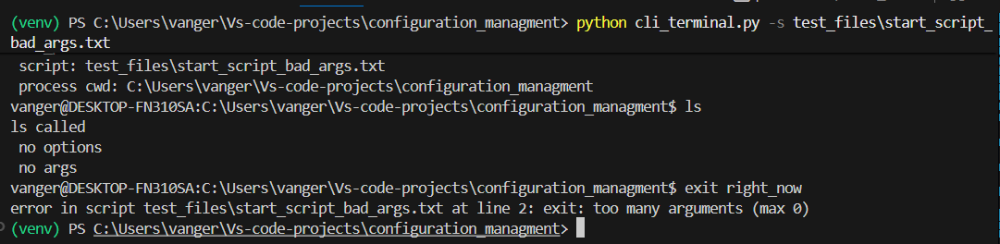
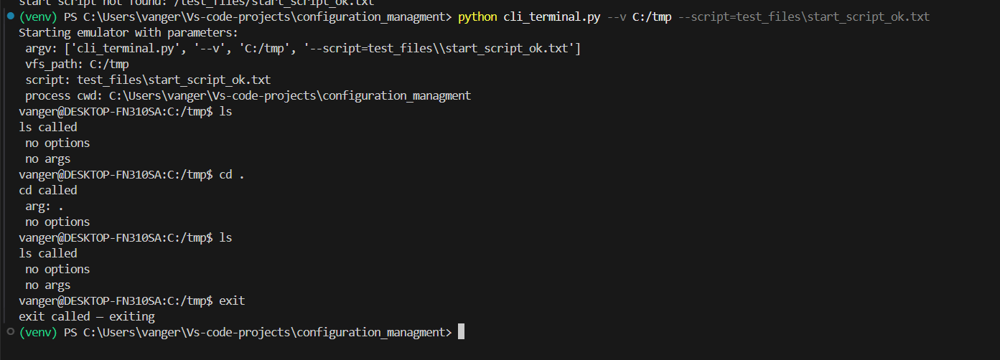

# Этап 2. COnfiguration
## Общее описание
CLI-приложение для эмулятора языка-оболочки UNIX-системы
На этапе 1: реализован простейший прототип командного интерпретатора (CLI) в виде REPL-цикла. Команды заглушки ls и cd, работающая команда exit.
На этапе 2: добавлена поддержка конфигурации через параметры командной строки и стратовых скриптов.

## Реализованные функции
1. "приглашение к вводу" пользователь видит username@hostname:cwd.
2. парсер, который раскрывает переменные вида $HOME, $VAR.
3. Вывод ошибок: "команда не существует", "неверные аргументы", "неверное количество аргументов".
4. команды-заглушки ls и cd, выводят сообщение о своем вызове и с каким аргументами были вызваны.
5. команда exit при ее вводе программа завершает свою работу.
6. Добавлены параметры --vfs указывается путь до VFS, программа отображает его в "приглашении"
7. Добавлен параметр --script - путь к файлу стратового скрипта, который эмулятор выполняет при запуске, если в скрипте есть ошибка, то она выводится, а скрипт прекращается.

## Пример работы программы
пример ввода команды ls:





пример ввода команды с параметрами:





пример ввода с ошибочным число параметров:





пример ввода неизвестной команды:





пример работы команды с переменными реальных ОС:





пример ввода команды exit:





пример запуска скрипта с ошибкой:




пример запуска корректного скрипта:





## Установка и запуск
```bash
# Клонируем репозиторий
git clone https://github.com/vanger2607/MIREA_CONFIGURATION.git

# Переходим в папку проекта
cd MIREA_CONFIGURATION

# переходим в нужную ветку
git checkout stage_2_configuration
# Запускаем CLI-терминал
python cli_terminal.py

# Команды-примеры
# Пример корректного сценария:
python cli_terminal.py --vfs=/tmp --script=test_files\\start_script_ok.txt

# Пример скрипта с неизвестной командой
python cli_terminal.py --script=test_files\\start_script_unknown_cmd.txt

# Пример скрипта с недоступной переменной окружения 
python cli_terminal.py --script=test_files\\start_script_env_missed.txt

# Запуск bat скрипта:
.\\test_files\test_run.bat 


